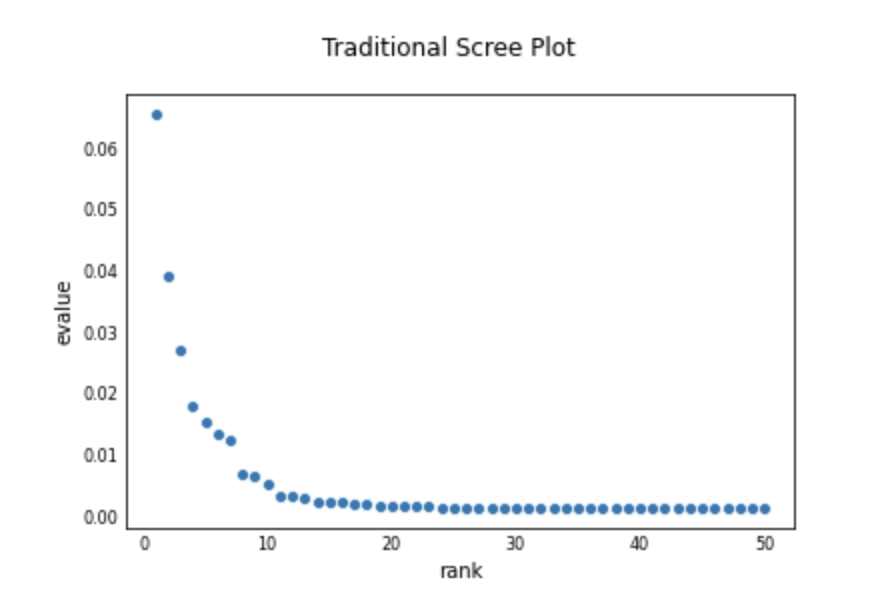
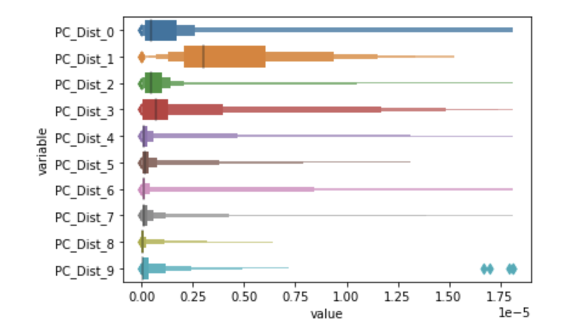

# __pcqc__
**Principal Component Quantile Check \
Robustly Identifying the Most Important PC's for Clustering and Nonlinear Dimensionality Reduction**

## __Purpose__
Current best practices for performing clustering or non-linear dimensionality reduction methods like t-sne, highlight the importance of preprocessing the data with a dimensionality reduction technique, like Principal Component Analysis, as discussed in the [SciKit-Learn Documentation](https://scikit-learn.org/stable/modules/generated/sklearn.manifold.TSNE.html).  

Selecting the correct number of principal components to retain can be challenging.  Popular methods for selecting the top principal components, such as a scree plot, are typically biased towards selecting principal components that only describe larger clusters, as the eigenvalues typically scale linearly with the size of the cluster.
<figure>

</figure>

\
Instead of simply looking at the top principal components, which are ranked by the amount of variance explained on average across the entire data set, we instead look near the tails of the distribution of variance explained by a principal component across all observations.

<figure>

</figure>

**Plotting the distribution for each principal component provides a different picture as to which principal components are most valuable. (e.g. The 3rd PC has a much wider tail than the 2nd PC.)**

<!--- Insert Plot of Variance Explained-->
\
We expect that for smaller clusters, a valuable principal component may not explain a lot of variance on average, but will explain significant amounts of variance for a subset of observations.  Consequently, to identify these significant principal components we instead look near the tail of the distribution of variance explained.  In our forthcoming work, we validate our approach by assessing the purity of clusters computed from these top principal components on single cell RNA-seq data provide a more rigorous framework for accurately identifying the optimal principal components for clustering.

## __Dependencies__
The pcqc package was developed using,
* Matploblib v3.2.1
* NumPy v1.18.4
* Pandas v1.0.3
* Seaborn v0.10.1
* SciPy v1.4.1

ScanPy v1.4.6 was used for analyzing the single cell RNA-seq data, but is not required to utilize the package.  For convenience, a docker container is included in the repo.  
